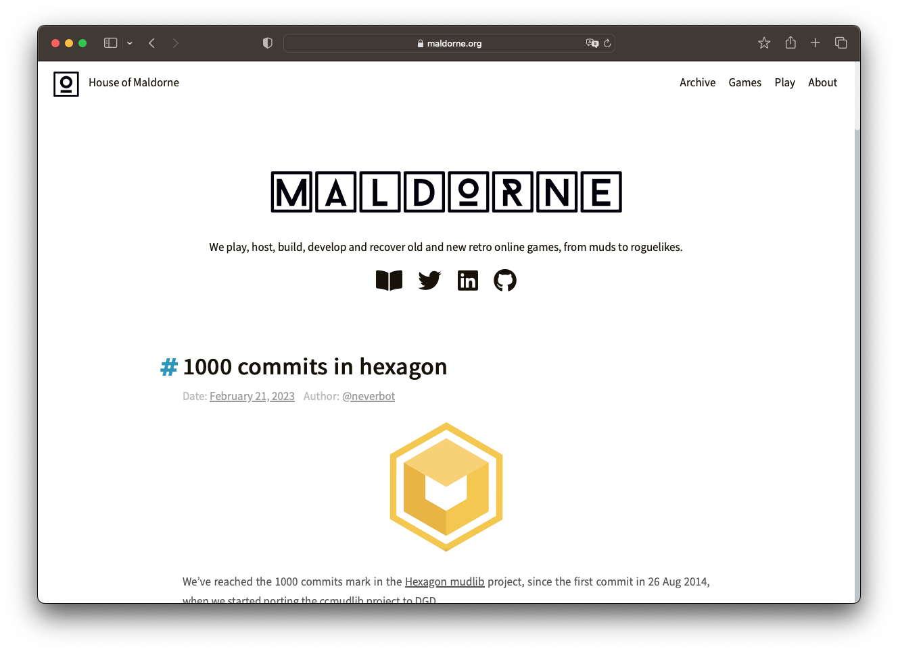
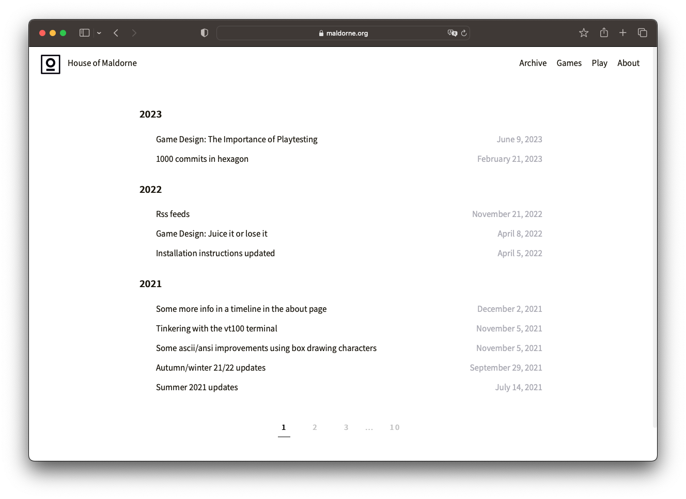

## House of Maldorne ([maldorne.org](https://maldorne.org/)) static page, made by Ivan Alonso ([@neverbot](https://github.com/neverbot))

Created with [Hexo](https://hexo.io/).

Theme used [maldorne-theme](https://github.com/neverbot/maldorne-theme), based on the [Chic Template](https://github.com/Siricee/hexo-theme-Chic) by [@Siricee](https://github.com/Siricee).

