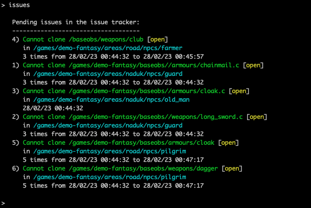

Using the new packages functionality, I've added a new package to the Hexagon mudlib: the issue tracker.



The packages adds its own command `issues`, where you can list, close, remove or open issues.

We can create new issues automatically, i.e. when a shop cannot load an item:

```
    // create new issue, same message as npcs equipment
    if (package("issues"))
      package("issues")->add_issue("Cannot clone " + file, this_object());
```