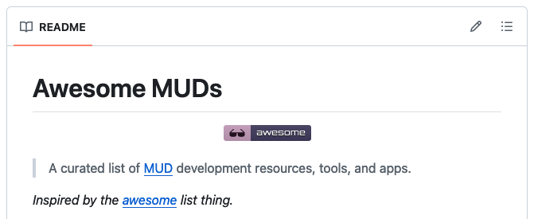

For some time now, we have been maintaining the GitHub repository [`awesome-muds`](https://github.com/maldorne/awesome-muds), which contains a large list of resources, articles, technologies, etc., related to the world of MUDs. It includes some history, links to available clients for different operating systems... a little bit of everything.

Take a look, and if you think there is something that could or should be changed, improved, or added, feel free to open an issue to discuss it.

[Link to the repository](https://github.com/maldorne/awesome-muds).

