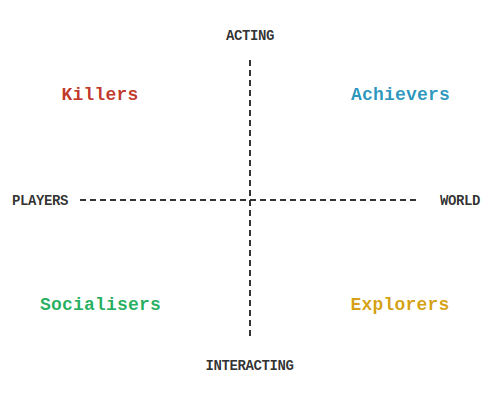

The academic paper "[*Hearts, Clubs, Diamonds, Spades: Players Who Suit MUDs*](https://mud.co.uk/richard/hcds.htm)" was written by [Richard Bartle](https://mud.co.uk/richard/). Published in 1996, it is a seminal work in the field of game studies and player psychology. In this paper, Bartle categorizes players of Multi-User Dungeons (MUDs) into four distinct types based on their preferred activities and motivations within the game.

*Recreation of the classic Bartle's player types diagram from the original 1996 paper.*

## The Four Player Types

1. **Achievers**: Players who focus on attaining in-game goals, collecting points, levels, equipment, and other measurable achievements. They want to *win*, or at least demonstrate mastery.
2. **Explorers**: Players who enjoy discovering new areas, learning about the game mechanics, and finding out the secrets within the game world. The joy is in the discovery itself, not in what they find.
3. **Socialisers**: Players who are primarily interested in interacting with other players, forming relationships, and engaging in conversations. The game is a backdrop for social interaction.
4. **Killers**: Players who thrive on competition with other players, seeking to assert their dominance and affect other players' gameplay. They need other players to exist, but not necessarily to cooperate.

## The Player Dynamics

What makes Bartle's taxonomy genuinely interesting is not just the classification itself, but the dynamics between player types. Bartle observed that increasing certain player types in a MUD directly affects the population of others. For instance, too many Killers will drive away Socialisers, which in turn reduces the supply of victims and eventually drives away the Killers themselves. A healthy MUD needs a balance of all four types.

This insight remains relevant for any online multiplayer game, even those far removed from text-based MUDs. Anyone who has seen a game community collapse under the weight of toxic PvP or watched an MMO server die after the social players left has witnessed Bartle's dynamics in action.

## Why It Matters for MUD Development

At Maldorne, we have been building multiplayer games with the [Hexagon mudlib](/2023/03/19/demo-game-now-fully-functional/) for years. Whether we are designing combat systems, crafting economies, or planning social spaces, Bartle's framework helps us ask the right questions: which player types does this feature serve? Are we accidentally pushing a type away?

For example, the weather and climate systems in our games affect exploration and survival, giving Explorers and Achievers something to engage with. The towns, guilds, and public spaces are designed with Socialisers in mind. And combat provides the competitive edge that Killers seek.

Understanding these dynamics is also crucial when [playtesting](/2023/06/09/game-design-the-importance-of-playtesting/) — observing which player type your testers gravitate towards tells you a lot about what your game is actually offering versus what you intended.

If you are interested in more MUD-related resources, we maintain a curated list in our [awesome-muds](https://github.com/maldorne/awesome-muds) repository.

## Read the Original

[Read it online](https://mud.co.uk/richard/hcds.htm), it is really worth it. At roughly 20 pages, it is an accessible and well-written read even if you have never played a MUD. The concepts apply to any multiplayer game.
