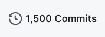

We've reached the 1500 commits mark in the [Hexagon mudlib](https://github.com/maldorne/hexagon) project, since the first commit in 26 Aug 2014, when we started porting the ccmudlib project to DGD.
